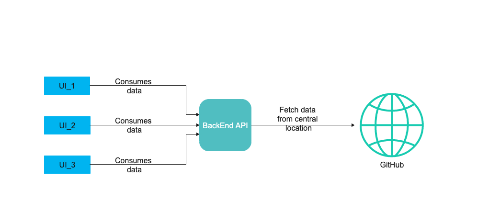

## Airavata Coding Challenge for CIRC

##### Problem : CIRC currently duplicates its clients information in three different websites. Propose a solution to maintain the metadata in a single canonical github location.

- Approach to resolve the problem
  
  Overview of the Project:
  

Source Data link:
https://github.com/SwetShah/hello-world/data.json

- Summary

  - Three different websites are created using React JS, Vue JS and Angular JS and all of those fetches the same data from same github location as mentioned above in Source Data link.
  - An API is created in java using Spring Boot framework to fetch the data from the github location as mentioned above in Source Data link and these API is used by all the three websites to render the data.
  - Hence, there is no data duplicacy or inconsistency and only single source of data is used.
  - Currently, all the three websites display the same information considering the current scope of problem but this can be expanded to make it more dynamic. 
  
- Future Scope
  
  - All of the configuration are currently hardcoded but this can be externalized using services such as Consul or AWS.
  - Alternatively for data source, we can have a file system or Database to make it more robust.
  - We can integrate Active MQ to make the real time updates to the data and notifying the application about the updates and correspondingly refreshing the UI using ajax calls to display the updated data without restarting any servers.
  
##### To run the application
Please refer following links to run the applications:
- Backend: [Run Backend application](airavata-backend/README.md)
- UI-1 React JS: [Run React JS application](airavata-ui-1-react/README.md)
- UI-2 Vue JS:  [Run Vue JS application](airavata-ui-2-vue/README.md)
- UI-3 Angular:  [Run Angular application](airavata-ui3-angular/README.md)
  
  

